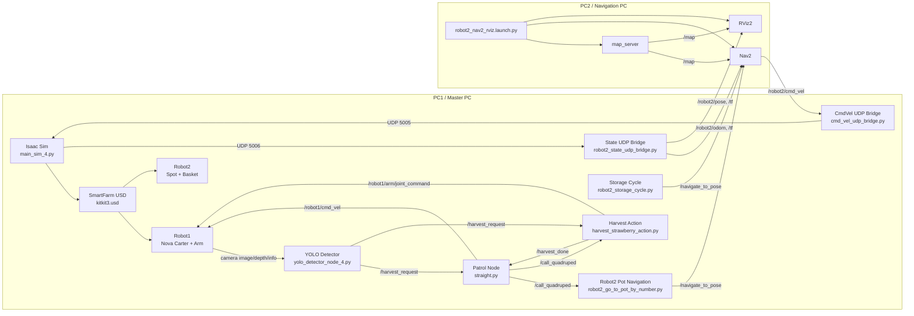

# 🍓 SmartFarm Dual-Robot Harvest & Transport System

<p align="center">
  <b>ROS2 Humble · NVIDIA Isaac Sim · Nav2 · YOLO · Nova Carter · Spot</b>
</p>

<p align="center">
  
  
  
  
  
</p>

---

## 📌 Overview

이 프로젝트는 **스마트팜 환경에서 두 대의 로봇이 협업하여 딸기 수확과 운반을 수행하는 ROS2 기반 시뮬레이션 시스템**입니다.

- **Robot1: Nova Carter + 로봇팔**  
  화분 라인을 순찰하고, 카메라와 YOLO를 이용해 익은 딸기를 인식한 뒤 로봇팔로 수확합니다.

- **Robot2: Spot + Basket**  
  Robot1의 호출 신호를 받아 해당 화분 위치로 이동하고, 바구니가 가득 차면 창고로 이동해 수확물을 운반합니다.

전체 시스템은 **Isaac Sim 시뮬레이션**, **YOLO 기반 인식**, **ROS2 topic/service/action 통신**, **Nav2 자율주행**, **UDP bridge 기반 Spot 제어**로 구성됩니다.

- SmartFarm usd인 kitkit2.usd는 100MB가 넘어서 제외했습니다.
---

## 🧭 Table of Contents

- [Key Features](#-key-features)
- [System Architecture](#-system-architecture)
- [Logic Flow](#-logic-flow)
- [Repository Structure](#-repository-structure)
- [Main Nodes](#-main-nodes)
- [Topics, Services, Actions](#-topics-services-actions)
- [Environment](#-environment)
- [Installation](#-installation)
- [How to Run](#-how-to-run)
- [Test Commands](#-test-commands)
- [Troubleshooting](#-troubleshooting)
- [Notes](#-notes)

---

## ✨ Key Features

### 1. Robot1: Patrol, Detection, Harvest

- Nova Carter가 스마트팜 내부 화분 라인을 순찰합니다.
- Isaac Sim 카메라에서 RGB, Depth, CameraInfo 데이터를 ROS2 topic으로 발행합니다.
- YOLO detector가 익은 딸기를 인식하고 3D 좌표를 계산합니다.
- 로봇팔이 인식된 딸기를 수확하고 바구니에 넣습니다.
- 수확 지점 정보를 Robot2에게 `/call_quadruped` topic으로 전달합니다.

### 2. Robot2: Navigation, Transport, Storage Cycle

- Robot2는 `/call_quadruped` 메시지를 받아 몇 번째 화분으로 이동할지 판단합니다.
- Nav2의 `/navigate_to_pose` action을 이용해 목표 위치로 이동합니다.
- Robot2의 바구니 적재량이 기준치에 도달하면 창고 왕복 시나리오를 수행합니다.
- 창고에서 바구니를 비운 뒤 기존 작업 위치로 복귀합니다.

### 3. Isaac Sim ↔ ROS2 Bridge

- Isaac Sim 내부 Spot policy는 UDP 5005로 속도 명령을 받습니다.
- Spot의 현재 위치는 UDP 5006으로 ROS2 bridge에 전달됩니다.
- ROS2에서는 `/robot2/odom`, `/robot2/pose`, `/tf`를 통해 Nav2와 RViz에서 Robot2 상태를 확인합니다.

---

## 🏗 System Architecture



---

## 🔄 Logic Flow

아래 이미지는 전체 수확·운반 시나리오의 실행 흐름을 한눈에 보여주는 플로우차트입니다.

<p align="center">
  
</p>

---

## 📁 Repository Structure

```bash
.
├── README.md
├── main_sim_4.py
├── yolo_detector_node_4.py
├── straight.py
├── harvest_strawberry_action.py
├── robot2_go_to_pot_by_number.py
├── robot2_storage_cycle.py
├── cmd_vel_udp_bridge.py
├── robot2_state_udp_bridge.py
├── robot2_nav2_rviz.launch.py
├── robot2_nav2_params.yaml
├── robot2_spot.rviz
└── resource/
    ├── kitkit2.usd
    ├── kitkit3.usd
    ├── best_10n_isaac.pt
    └── grap_str_model.pt
```

> 파일 이름에 `(1)` 또는 공백이 붙어 있다면 실행 전에 이름을 정리하는 것을 권장합니다.

```bash
mv "main_sim_4 (1).py" main_sim_4.py
mv "straight (1).py" straight.py
mv "harvest_strawberry_action (1).py" harvest_strawberry_action.py
mv "robot2_state_udp_bridge (1).py" robot2_state_udp_bridge.py
mv "cmd_vel_udp_bridge (1).py" cmd_vel_udp_bridge.py
```

---

## 🧩 Main Nodes

| Node / File | Role | Main Input | Main Output |
|---|---|---|---|
| `main_sim_4.py` | Isaac Sim 통합 시뮬레이션 실행 | UDP 5005 | Camera topics, UDP 5006 |
| `yolo_detector_node_4.py` | 익은 딸기 검출 및 3D 좌표 계산 | RGB / Depth / CameraInfo | `/harvest_request` |
| `straight.py` | Robot1 순찰 및 Robot2 호출 | `/harvest_request`, `/harvest_done` | `/robot1/cmd_vel`, `/call_quadruped` |
| `harvest_strawberry_action.py` | 로봇팔 수확 및 그리퍼 제어 | `/call_quadruped`, `/harvest_request` | `/robot1/arm/joint_command`, `/harvest_done` |
| `robot2_go_to_pot_by_number.py` | Robot2 화분 이동 goal 생성 | `/call_quadruped` | `/navigate_to_pose` |
| `robot2_storage_cycle.py` | Robot2 창고 왕복 service | `/robot2/start_storage_cycle` | `/navigate_to_pose` |
| `cmd_vel_udp_bridge.py` | Robot2 cmd_vel을 Isaac Sim UDP로 전달 | `/robot2/cmd_vel` | UDP 5005 |
| `robot2_state_udp_bridge.py` | Isaac Sim Robot2 pose를 ROS2 odom/tf로 변환 | UDP 5006 | `/robot2/odom`, `/robot2/pose`, `/tf` |
| `robot2_nav2_rviz.launch.py` | Nav2, map_server, RViz 실행 | map yaml, params | Nav2 stack, RViz2 |

---

## 🔌 Topics, Services, Actions

### Robot1 Topics

| Name | Type | Description |
|---|---|---|
| `/robot1/cmd_vel` | `geometry_msgs/Twist` | Nova Carter 전용 이동 명령 |
| `/harvest_request` | `std_msgs/String` | YOLO가 검출한 딸기 3D 좌표 JSON |
| `/harvest_done` | `std_msgs/Bool` | 수확 완료 신호 |
| `/robot1/arm/joint_command` | `sensor_msgs/JointState` | 로봇팔 관절 명령 |
| `/robot1/gripper/command` | `std_msgs/Float64` | 그리퍼 제어 명령 |

### Robot1 → Robot2 Call Topic

| Name | Type | Description |
|---|---|---|
| `/call_quadruped` | `std_msgs/String` | Robot2 호출 메시지 |

Example:

```json
{
  "strawberry": {"x": -1.86, "y": -0.49, "z": 2.34},
  "pot_stop": 3
}
```

### Robot2 Topics / Services / Actions

| Name | Type | Description |
|---|---|---|
| `/robot2/cmd_vel` | `geometry_msgs/Twist` | Spot 전용 속도 명령 |
| `/robot2/odom` | `nav_msgs/Odometry` | Robot2 odometry |
| `/robot2/pose` | `geometry_msgs/PoseStamped` | Robot2 현재 위치 |
| `/tf` | `tf2_msgs/TFMessage` | Robot2 TF tree |
| `/navigate_to_pose` | `nav2_msgs/action/NavigateToPose` | Nav2 목표 이동 action |
| `/robot2/start_storage_cycle` | `std_srvs/srv/Trigger` | 창고 왕복 시작 service |
| `/robot2/pot_goal_status` | `std_msgs/String` | 화분 이동 상태 |
| `/robot2/storage_cycle_status` | `std_msgs/String` | 창고 왕복 상태 |

---

## 🖥 Environment

| Item | Version / Description |
|---|---|
| OS | Ubuntu 22.04 LTS |
| ROS2 | Humble |
| Simulator | NVIDIA Isaac Sim |
| Navigation | Nav2 |
| Vision | YOLO / Ultralytics |
| Language | Python 3.10 |
| Main Libraries | `rclpy`, `nav2_msgs`, `cv_bridge`, `message_filters`, `ultralytics`, `opencv-python`, `numpy`, `torch`, `pandas`, `aquacrop` |

---

## 📦 Installation

### 1. ROS2 Packages

```bash
sudo apt update

sudo apt install -y \
  ros-humble-navigation2 \
  ros-humble-nav2-bringup \
  ros-humble-cv-bridge \
  ros-humble-message-filters \
  ros-humble-tf2-ros \
  ros-humble-tf2-geometry-msgs
```

### 2. Python Packages

```bash
pip install ultralytics opencv-python numpy pandas torch aquacrop
```

### 3. Common ROS2 Environment

Run this in every terminal:

```bash
source /opt/ros/humble/setup.bash
export ROS_DOMAIN_ID=135
export ROS_LOCALHOST_ONLY=0
```

---

## 🚀 How to Run

> Assumption: all scripts are located in `~/dev_ws`.

### PC1 - Terminal 1. Isaac Sim

```bash
cd ~/dev_ws/isaac_sim/isaacsim/_build/linux-x86_64/release

source /opt/ros/humble/setup.bash
export ROS_DOMAIN_ID=135
export ROS_LOCALHOST_ONLY=0

./python.sh ~/dev_ws/main_sim_4.py
```

### PC1 - Terminal 2. Robot2 State Bridge

```bash
cd ~/dev_ws

source /opt/ros/humble/setup.bash
export ROS_DOMAIN_ID=135
export ROS_LOCALHOST_ONLY=0

python3 robot2_state_udp_bridge.py
```

### PC1 - Terminal 3. Robot2 CmdVel Bridge

```bash
cd ~/dev_ws

source /opt/ros/humble/setup.bash
export ROS_DOMAIN_ID=135
export ROS_LOCALHOST_ONLY=0

python3 cmd_vel_udp_bridge.py
```

### PC1 - Terminal 4. YOLO Detector

```bash
cd ~/dev_ws

source /opt/ros/humble/setup.bash
export ROS_DOMAIN_ID=135
export ROS_LOCALHOST_ONLY=0

python3 yolo_detector_node_4.py
```

### PC1 - Terminal 5. Robot1 Patrol Node

```bash
cd ~/dev_ws

source /opt/ros/humble/setup.bash
export ROS_DOMAIN_ID=135
export ROS_LOCALHOST_ONLY=0

python3 straight.py
```

### PC1 - Terminal 6. Robot1 Harvest Action

```bash
cd ~/dev_ws

source /opt/ros/humble/setup.bash
export ROS_DOMAIN_ID=135
export ROS_LOCALHOST_ONLY=0

python3 harvest_strawberry_action.py
```

### PC1 - Terminal 7. Robot2 Pot Navigation

```bash
cd ~/dev_ws

source /opt/ros/humble/setup.bash
export ROS_DOMAIN_ID=135
export ROS_LOCALHOST_ONLY=0

python3 robot2_go_to_pot_by_number.py
```

### PC1 - Terminal 8. Robot2 Storage Cycle

```bash
cd ~/dev_ws

source /opt/ros/humble/setup.bash
export ROS_DOMAIN_ID=135
export ROS_LOCALHOST_ONLY=0

python3 robot2_storage_cycle.py
```

### PC2 - Nav2 + RViz

```bash
cd ~/dev_ws

source /opt/ros/humble/setup.bash
export ROS_DOMAIN_ID=135
export ROS_LOCALHOST_ONLY=0

ros2 launch robot2_launch robot2_nav2_rviz.launch.py
```

If package launch does not work:

```bash
ros2 launch ~/dev_ws/robot2_launch/launch/robot2_nav2_rviz.launch.py
```

---

## 🧪 Test Commands

### Check Robot2 pose

```bash
ros2 topic echo /robot2/pose --once
```

### Check Robot2 TF

```bash
ros2 run tf2_ros tf2_echo map robot2/base_link
```

### Send fake Robot2 call

```bash
ros2 topic pub -1 /call_quadruped std_msgs/msg/String \
"{data: '{\"strawberry\": {\"x\": -1.86, \"y\": -0.49, \"z\": 2.34}, \"pot_stop\": 3}'}"
```

### Test storage service

```bash
ros2 service call /robot2/start_storage_cycle std_srvs/srv/Trigger "{}"
```

### Check Robot2 velocity command

```bash
ros2 topic echo /robot2/cmd_vel
```

---

## 🧯 Troubleshooting

### 1. Robot1 and Robot2 move together

Most likely cause: both robots are sharing `/cmd_vel` or `/cmd_vel_nav`.

Check:

```bash
ros2 topic info /cmd_vel -v
ros2 topic info /cmd_vel_nav -v
ros2 topic info /robot2/cmd_vel -v
```

Recommended separation:

```text
Robot1: /robot1/cmd_vel
Robot2: /robot2/cmd_vel
```

### 2. Robot2 does not move

Check:

```bash
ros2 topic echo /robot2/cmd_vel
ros2 topic echo /robot2/pose
ros2 run tf2_ros tf2_echo map robot2/base_link
```

- No `/robot2/cmd_vel`: Nav2 or action goal issue.
- No `/robot2/pose`: UDP state bridge issue.
- No TF: Nav2 cannot localize Robot2.

### 3. RViz map does not appear

Check map server lifecycle:

```bash
ros2 lifecycle get /map_server
```

Activate manually if needed:

```bash
ros2 lifecycle set /map_server configure
ros2 lifecycle set /map_server activate
```

RViz Map Display settings:

```text
Reliability: Reliable
Durability: Transient Local
```

### 4. `/call_quadruped` does not work

This system uses `std_msgs/String` JSON.

Check type:

```bash
ros2 topic info /call_quadruped -v
```

Correct test:

```bash
ros2 topic pub -1 /call_quadruped std_msgs/msg/String \
"{data: '{\"strawberry\": {\"x\": -1.86, \"y\": -0.49, \"z\": 2.34}, \"pot_stop\": 3}'}"
```

Do not run old `Int32` test publisher together with the JSON version.

---

## ✅ Checklist Before Demo

- [ ] `ROS_DOMAIN_ID=135` on every PC
- [ ] `ROS_LOCALHOST_ONLY=0` on every PC
- [ ] Isaac Sim stage loads correctly
- [ ] `/robot2/pose` is published
- [ ] `map → robot2/odom → robot2/base_link` TF exists
- [ ] `/call_quadruped` type is `std_msgs/String`
- [ ] Robot1 uses `/robot1/cmd_vel`
- [ ] Robot2 uses `/robot2/cmd_vel`
- [ ] RViz map display uses `Transient Local`

---

## 📌 Notes

- Robot1 and Robot2 must not share a global `/cmd_vel`.
- Robot2 movement is controlled through Nav2 action goals, not by directly publishing velocity from scenario nodes.
- Isaac Sim Spot policy receives velocity through UDP 5005.
- Robot2 odometry and TF are generated from UDP 5006 state packets.

---

## ✅ Summary

This project demonstrates a dual-robot smart farm workflow where Robot1 detects and harvests strawberries, while Robot2 navigates to requested pot locations and transports harvested strawberries to storage. The system connects perception, manipulation, navigation, and simulation through ROS2 topics, services, actions, and UDP bridges.
